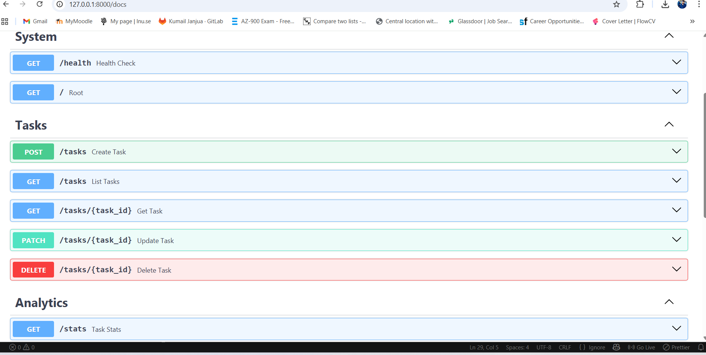
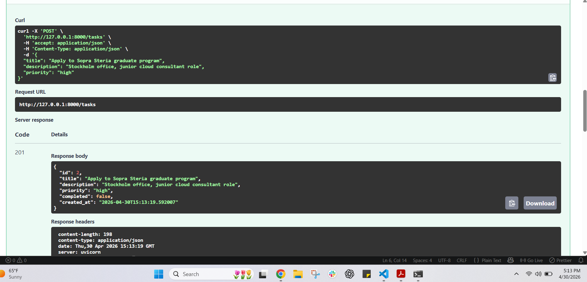
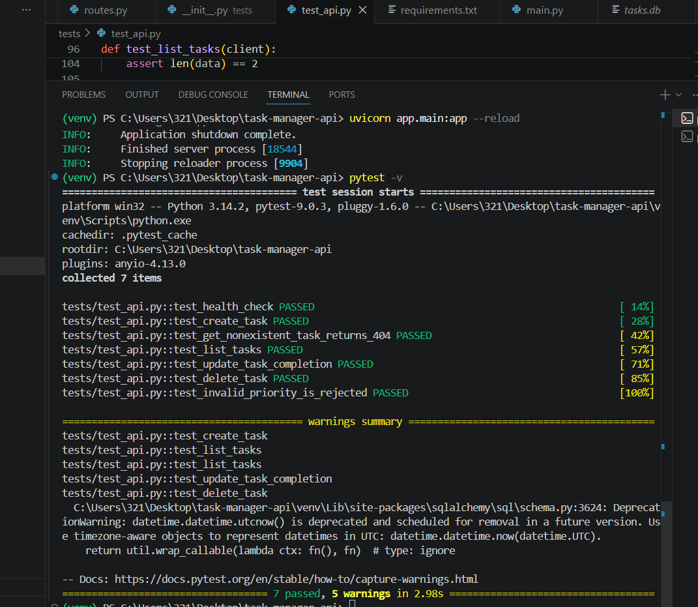

# Task Manager REST API

> A production-style REST API built in Python with FastAPI and SQLAlchemy. Demonstrates clean architecture, full CRUD operations, input validation, persistence, dependency injection, and automated integration testing.



---

## Project Overview

A complete backend service for managing tasks (a to-do style domain), built to demonstrate professional software engineering practices in Python:

- Clean separation of concerns (models, database, routes, application entry point)
- Auto-generated interactive API documentation (OpenAPI / Swagger)
- Strict input validation via Pydantic
- ORM-based persistence via SQLAlchemy (SQLite locally, easily swappable for PostgreSQL or Azure SQL)
- Automated integration tests with pytest — every endpoint covered

**Stack:** Python · FastAPI · SQLAlchemy · Pydantic · Pytest · Uvicorn

---

## Endpoints

| Method | Path | Purpose |
|--------|------|---------|
| `GET` | `/health` | Liveness probe for monitoring / load balancers |
| `POST` | `/tasks` | Create a new task |
| `GET` | `/tasks` | List all tasks (filterable by `completed` and `priority`) |
| `GET` | `/tasks/{id}` | Retrieve a single task |
| `PATCH` | `/tasks/{id}` | Partially update a task |
| `DELETE` | `/tasks/{id}` | Delete a task |
| `GET` | `/stats` | Aggregate statistics across all tasks |
| `GET` | `/docs` | Auto-generated interactive API documentation |

---

## Demo

### Creating a task (`POST /tasks`)



The API validates input via Pydantic, persists the task to SQLite, and returns the created resource with `201 Created` status.

### Automated test suite (7/7 passing)



Every endpoint is covered by an integration test. Tests run against a fresh temporary database to keep them fast and deterministic.

---

## Architecture

```
app/
├── main.py        # FastAPI application entry point and lifespan management
├── routes.py      # HTTP routes (CRUD + filtering + stats)
├── models.py      # SQLAlchemy ORM model + Pydantic request/response schemas
└── database.py    # Engine, session factory, dependency-injected get_db()

tests/
└── test_api.py    # 7 integration tests covering every endpoint
```

**Key design decisions:**

- **Dependency injection for the database session** — each request gets its own session, automatically closed afterwards (FastAPI's `Depends(get_db)` pattern).
- **Separate Pydantic schemas for create / update / response** — different operations have different validation needs (e.g., `id` is set by the database, not the user).
- **`PATCH` for updates** — allows partial updates without resending unchanged fields, more REST-correct than `PUT`.
- **Cloud-ready persistence layer** — `DATABASE_URL` is the only thing that changes to deploy on PostgreSQL or Azure SQL.

---

## Running Locally

```bash
# Create and activate a virtual environment
python -m venv venv
.\venv\Scripts\Activate.ps1   # Windows PowerShell
# source venv/bin/activate    # macOS / Linux

# Install dependencies
pip install -r requirements.txt

# Start the API
uvicorn app.main:app --reload
```

Then open:

- **API root:** http://127.0.0.1:8000
- **Interactive docs:** http://127.0.0.1:8000/docs

---

## Running Tests

```bash
pytest -v
```

All 7 integration tests should pass, covering health checks, CRUD operations, filtering, validation, and error handling.

---

## Skills Demonstrated

**Backend & APIs:** REST API design, HTTP semantics, status codes, OpenAPI / Swagger
**Python:** FastAPI, Pydantic, SQLAlchemy, async lifespan handlers, type hints
**Persistence:** ORM modelling, dependency-injected sessions, environment-portable database layer
**Testing:** Pytest, integration testing, fixtures, dependency overrides
**Software practices:** Modular architecture, separation of concerns, version control, dependency management

---

## Author

**Kumail Janjua** 
